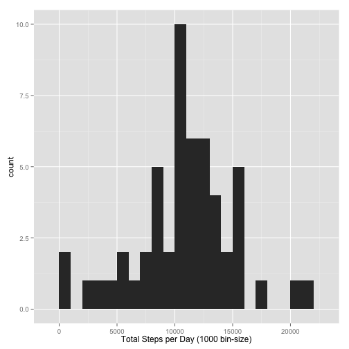
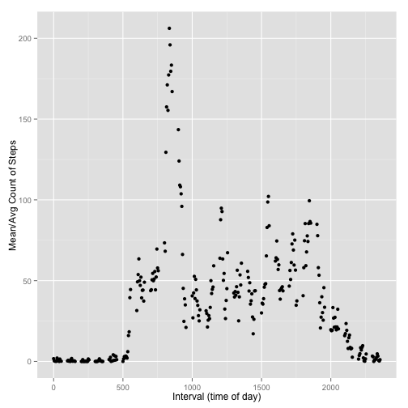
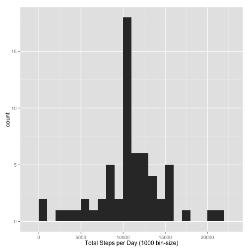
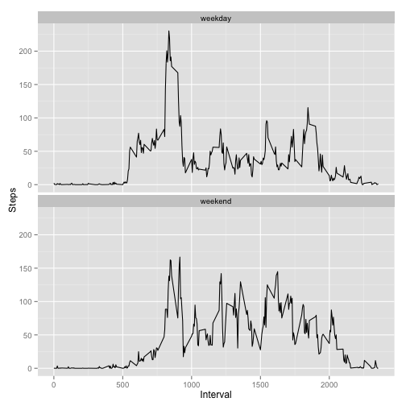

Reproducible Research: Peer Assessment 1
----------------------------------------
by Thomas Mann

## GLOBAL DEFINITIONS, Needed Libraries


```r
## LOCALE DEFINITION
Sys.setlocale("LC_TIME", "C")
```

```
## [1] "C"
```

```r

## LIBRARIES
library(plyr)
library(ggplot2)

## GLOBALS: FILE Locations

fileUrl <- "https://d396qusza40orc.cloudfront.net/repdata%2Fdata%2Factivity.zip"
fileZip <- "activity.zip"
fileCsv <- "activity.csv"
```


## Loading and preprocessing the data
1. Load the data
2. Process/transform the data (if necessary) into a format suitable for your analysis


```r
## DOWNLOAD

if (!(file.exists(fileZip))) {
    download.file(fileUrl, fileZip, "curl", quiet = FALSE, mode = "wb", cacheOK = TRUE)
}

## UNZIP

if (!(file.exists(fileCsv))) {
    unzip(fileZip, overwrite = TRUE, junkpaths = TRUE, exdir = ".")
    download.file(fileUrl, fileZip, "curl", quiet = FALSE, mode = "wb", cacheOK = TRUE)
}

## LOAD INTO MEMORY

data <- read.csv(fileCsv)
```


## What is mean total number of steps taken per day?
1. Make a histogram of the total number of steps taken each day
2. Calculate and report the mean and median total number of steps taken per day


```r
## Calculate Sum of Steps per Date
dataSumDay <- ddply(data, ~date, summarize, sumStepsPerDay = sum(steps))

## Total Steps per Day - Histogramm
qplot(dataSumDay$sumStepsPerDay, xlab = "Total Steps per Day (1000 bin-size)", 
    binwidth = 1000, geom = "histogram")
```

 

```r

## Mean
stepsMean <- mean(dataSumDay$sumStepsPerDay, na.rm = TRUE)
print(c("MEAN:", stepsMean))
```

```
## [1] "MEAN:"            "10766.1886792453"
```

```r

## Median
stepsMedian <- median(dataSumDay$sumStepsPerDay, na.rm = TRUE)
print(c("MEDIAN:", stepsMedian))
```

```
## [1] "MEDIAN:" "10765"
```


## What is the average daily activity pattern?
1. Make a time series plot (i.e. type = "l") of the 5-minute interval (x-axis) and the average number of steps taken, averaged across all days (y-axis)
2. Which 5-minute interval, on average across all the days in the dataset, contains the maximum number of steps?


```r
## Take only Complete Cases (nonNA parts)
dataNonNA <- data[complete.cases(data), ]

## Apply Sum on Intervals with calculated Means
dataActivityPattern <- ddply(dataNonNA, ~interval, summarize, stepsIntervalMean = mean(steps))

## Plot
qplot(dataActivityPattern$interval, dataActivityPattern$stepsIntervalMean, type = "l", 
    xlab = "Interval (time of day)", ylab = "Mean/Avg Count of Steps")
```

 

```r

## Search for Interval(s) with Max Value
maxInterval <- subset(dataActivityPattern, stepsIntervalMean == max(dataActivityPattern$stepsIntervalMean))$interval

print(c("INTERVAL:", maxInterval))
```

```
## [1] "INTERVAL:" "835"
```


## Imputing missing values
1. Calculate and report the total number of missing values in the dataset (i.e. the total number of rows with NAs)
2. Devise a strategy for filling in all of the missing values in the dataset. The strategy does not need to be sophisticated. For example, you could use the mean/median for that day, or the mean for that 5-minute interval, etc.
3. Create a new dataset that is equal to the original dataset but with the missing data filled in.
4. Make a histogram of the total number of steps taken each day and Calculate and report the mean and median total number of steps taken per day. Do these values differ from the estimates from the first part of the assignment? What is the impact of imputing missing data on the estimates of the total daily number of steps?


```r
## Search for NA's
dataNA <- data[is.na(data$steps), ]
## Count of NA rows
rowCountNA <- nrow(dataNA)
print(c("NA COUNT:", rowCountNA))
```

```
## [1] "NA COUNT:" "2304"
```

```r

## Create list of Dates with NA's (but no duplicates)
listDateWithNA <- as.character(dataNA$date[!duplicated(dataNA$date)])

## replace for this Dates the values with the known means
for (i in (1:length(listDateWithNA))) {
    dataForDate <- subset(data, date == listDateWithNA[i])
    j <- rownames(dataForDate)
    data[j, 1] <- dataActivityPattern$stepsIntervalMean
}

## new DataFrame
dataCor <- ddply(data, ~date, summarize, sumStepsPerDay = sum(steps))

## Total Steps per Day - Histogramm (corrected)
qplot(dataCor$sumStepsPerDay, xlab = "Total Steps per Day (1000 bin-size)", 
    binwidth = 1000, geom = "histogram")
```

 

```r

## Mean (corrected)
stepsMeanCor <- mean(dataCor$sumStepsPerDay)
print(c("NEW:", stepsMeanCor))
```

```
## [1] "NEW:"             "10766.1886792453"
```

```r
print(c("OLD:", stepsMean))
```

```
## [1] "OLD:"             "10766.1886792453"
```

```r

## Median (corrected)
stepsMedianCor <- median(dataCor$sumStepsPerDay)
print(c("NEW:", stepsMedianCor))
```

```
## [1] "NEW:"             "10766.1886792453"
```

```r
print(c("OLD:", stepsMedian))
```

```
## [1] "OLD:"  "10765"
```

COMMENT: Small Impact on Median, No Impact on Mean as we are replacing with means/sums, the mean/median doesnt change a lot

## Are there differences in activity patterns between weekdays and weekends?
1. Create a new factor variable in the dataset with two levels – “weekday” and “weekend” indicating whether a given date is a weekday or weekend day.
2. Make a panel plot containing a time series plot (i.e. type = "l") of the 5-minute interval (x-axis) and the average number of steps taken, averaged across all weekday days or weekend days (y-axis).


```r
## List of Weekend-Days
weekendDays <- weekdays(as.Date(as.character(data$date), "%Y-%m-%d")) %in% c("Sunday", 
    "Saturday")

## New Column & Factoriziation
data[!weekendDays, "dayType"] <- c("weekday")
data[weekendDays, "dayType"] <- c("weekend")
data$dayType <- factor(data$dayType)

## Calculation
dataWeekday <- ddply(data, ~dayType + interval, summarize, stepsMean = mean(steps))

## Plot
plot <- ggplot(dataWeekday, aes(x = interval, y = stepsMean)) + geom_line(colour = "black")

plot <- plot + facet_wrap(~dayType, nrow = 2) + labs(x = "Interval", y = "Steps")
print(plot)
```

 

COMMENT: Yes there is a difference based on Day of Week, person is more lazy on weekends
